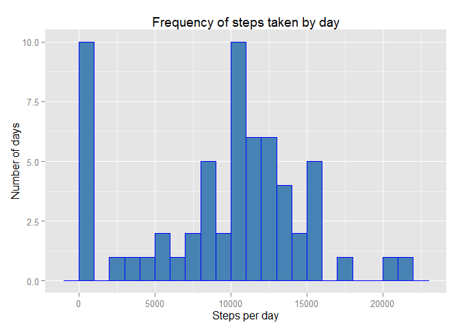
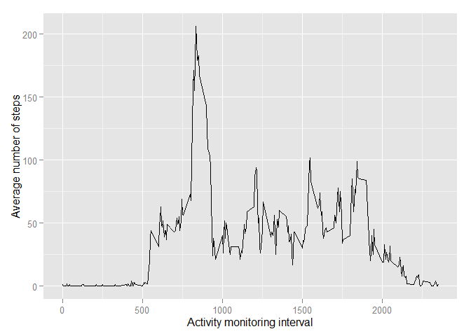
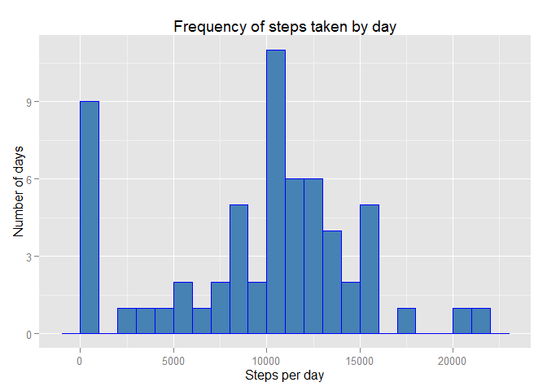
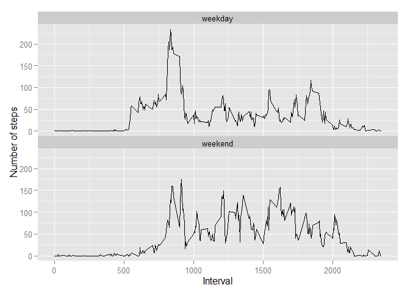

# Reproducible Research: Peer Assessment 1
*****
*****

##  Loading and preprocessing the data
* Load all required packages

```r
library(lubridate)
library(dplyr)
library(xtable)
library(grid)
library(ggplot2)
library(chron)
library(knitr)
opts_chunk$set(fig.path = "figure/")
opts_knit$set(unnamed.chunk.label = "fig")
```
*****
* Read activity data file  "activity.csv"
* Use group_by and summarize functions to create a new data table with date and total steps taken on that date
* Use group_by and summarize functions to create a new data table with interval and average steps taken during that interval across all dates


```r
activityData <- read.csv("./activity.csv", header = TRUE, stringsAsFactors = FALSE)
activityData$date <- ymd(activityData$date)

activityDataTbl <- tbl_df(activityData)
rm(activityData)

numnavalues <- sum(is.na(activityDataTbl$steps))

activitybydate <- group_by(activityDataTbl, date)
stepsbydate <- summarize(activitybydate, numsteps = sum(steps, na.rm = TRUE))

activitybyinterval <- group_by(activityDataTbl, interval)
stepsbyinterval <- summarize(activitybyinterval, 
                             numsteps = sum(steps, na.rm = TRUE))
avgstepsbyinterval <- summarize(activitybyinterval, avgsteps = 
                                as.integer(mean(steps, na.rm = TRUE)))
```
*****
## What is the mean total number of steps taken per day?

* We will create a histogram to show the distribution of number of steps taken each day and 
* Calculate mean and median of total number of steps taken per day

```r
g <- ggplot(stepsbydate, aes(numsteps))
p <- g + geom_histogram(binwidth = 1000, fill = "steelblue", color = "blue") +  
    labs(title = "Frequency of steps taken by day") +
    labs(x = "Steps per day", y = "Number of days")
print(p)
```

 

```r
mean <- mean(stepsbydate$numsteps, na.rm = TRUE)
median <- median(stepsbydate$numsteps, na.rm = TRUE)
```
* Average number of steps taken per day:     9354
* Median number of steps taken per day:      10395

*****
## What is the average daily activity pattern?
* To understand the daily activity pattern we will create a time series plot  of the 5-minute interval (x-axis) and the average number of steps taken in that interval, averaged across all days (y-axis)

```r
g <- ggplot(avgstepsbyinterval, aes(interval, avgsteps))
p <- g + geom_line() + 
    labs(x = "Activity monitoring interval", y = "Average number of steps")
print(p)
```

 
*****
* We will now get the 5-minute interval with the maximum number of steps on average across all days

```r
maxinterval <- subset(avgstepsbyinterval, avgstepsbyinterval$avgsteps == max(avgstepsbyinterval$avgsteps))
maxinterval
```

```
## Source: local data frame [1 x 2]
## 
##   interval avgsteps
## 1      835      206
```
****
* 5-minute interval with maximum number of steps on average across all days is 835 to 840

*****
## Imputing missing values
* Inspecting the activity data file we find that there are a number of days and intervals where there are missing values (coded as `NA`). The presence of missing days may introduce bias into some calculations or summaries of the data. We will create a new dataset by replacing the missing data valuee for each 5-minute interval with the average of the steps taken during a specific 5-minute interval for all days in the activity data.


```r
### Create new dataset with missing data filled in

modActivityDataTbl <- activityDataTbl %>%
    mutate(steps = ifelse(is.na(activityDataTbl$steps), 
         avgstepsbyinterval[avgstepsbyinterval$interval == interval,]$avgsteps, 
         activityDataTbl$steps))

modactivitybydate <- group_by(modActivityDataTbl, date)
modstepsbydate <- summarize(modactivitybydate, 
                            numsteps = sum(steps, na.rm = TRUE))
```
* We will now create a histogram of the total number of steps taken each day and also calculate and report the **mean** and **median** total number of steps taken per day using the new dataset. 


```r
g <- ggplot(modstepsbydate, aes(numsteps))
p <- g + geom_histogram(binwidth = 1000, fill = "steelblue", color = "blue") +  
    labs(title = "Frequency of steps taken by day") +
    labs(x = "Steps per day", y = "Number of days")
print(p)
```

 

```r
modmean <- mean(modstepsbydate$numsteps)
modmedian <- median(modstepsbydate$numsteps)
```
* Average number of steps taken per day:     9528   
* Median number of steps taken per day:      10439   
   
We notice that the distribution shape of the histogram does not change significantly from the histogram using original dataset with missing values but at the same time there are some minor changes to the frequency for individual intervals. E.g. For 1 - 1000, it changed from 10 days to 9 days and the 10000 to 11000 interval changed from 10 days to 11 days.   
    
Since we used the average of number of steps for each interval to fill in the missing values, the days with many missing values and those with missing values for interval with higher step count will move the mean and median of the average number of steps for the modified dataset to be higher than the original dataset.    

*****
## Are there differences in activity patterns between weekdays and weekends?
* To figure out any difference in activity patterns between weekdays and weekends we will create a factor variable with column name day in the dataset with two levels -- "weekday" and "weekend" indicating whether a given date is a weekday or weekend day.   
* We will then create  a panel plot containing a time series plotof the 5-minute interval (x-axis) and the average number of steps taken, averaged across all weekday days or weekend days (y-axis).
* The time series plot below shows that there is more activity over the weekend and the activity is speard over larger number of 5-minute interval vs weekday

```r
modActivityDataTbl <- activityDataTbl %>%
    mutate(steps = ifelse(is.na(activityDataTbl$steps), 
         avgstepsbyinterval[avgstepsbyinterval$interval == interval,]$avgsteps, 
         activityDataTbl$steps), 
         day = ifelse(is.weekend(activityDataTbl$date), "weekend", "weekday"))

modactivitybydate <- group_by(modActivityDataTbl, date)
modstepsbydate <- summarize(modactivitybydate, 
                            numsteps = sum(steps, na.rm = TRUE))

modactivitybyinterval <- group_by(modActivityDataTbl, day, interval)
avgmodstepsbyinterval <- summarize(modactivitybyinterval, 
                             avgsteps = mean(steps, na.rm = TRUE))
g <- ggplot(avgmodstepsbyinterval, aes(interval, avgsteps))
p <- g + geom_line() +  
    theme(legend.position = "top", panel.margin = unit(0, "points")) + 
    ## facet_grid(day ~ ., labeller = ) +
    facet_wrap(~ day, ncol = 1, nrow =2) +
    labs(x = "Interval", y = "Number of steps")
print(p)
```

 
